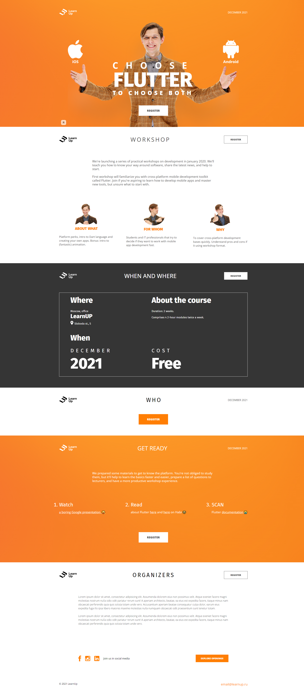

# Учебный проект: Лендинг LearnUp
Это мой учебный проект по вёрстке. Основная цель проекта - набить руку в вёрстке во время обучения.

## Что внутри?

- Базовая адаптивная вёрстка
- Простая структура
- Базовые технологии: HTML, CSS

## Как посмотреть?

1. Клонируйте репозиторий:
 git clone https://github.com/the-wind-dev/landing-1.git
2. Откройте файл index.html в браузере

## Скриншот результата
